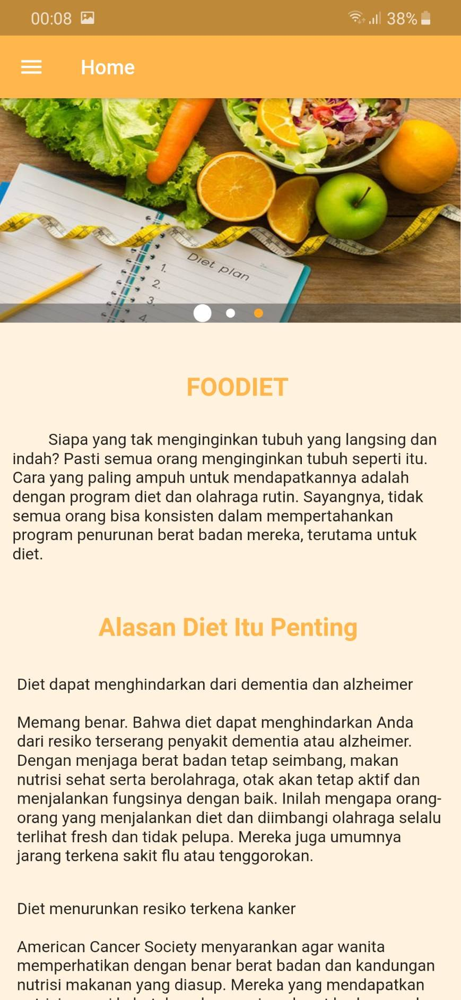
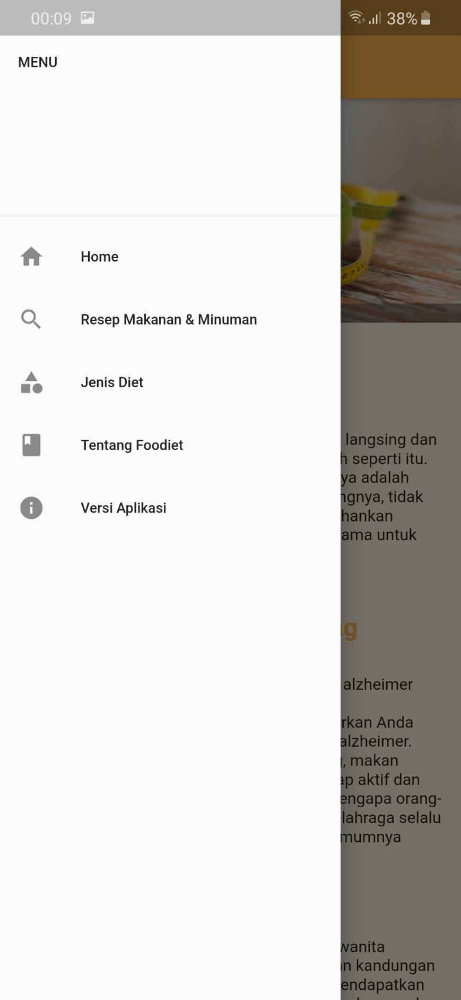
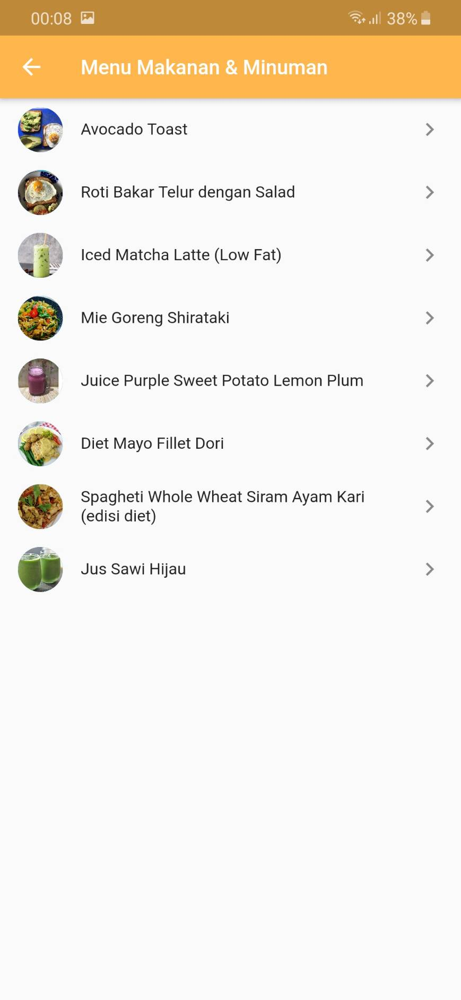
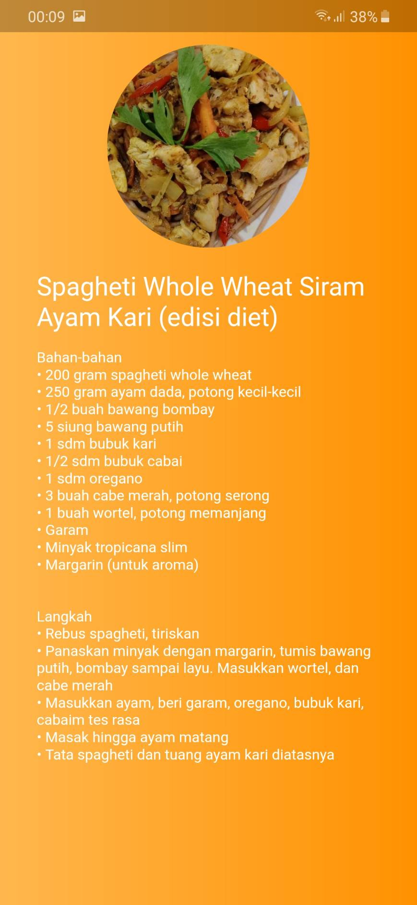
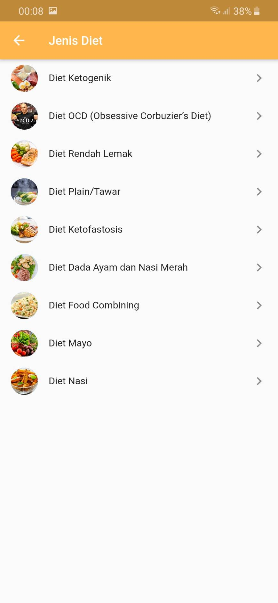
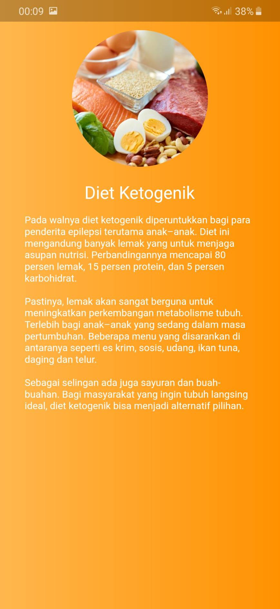
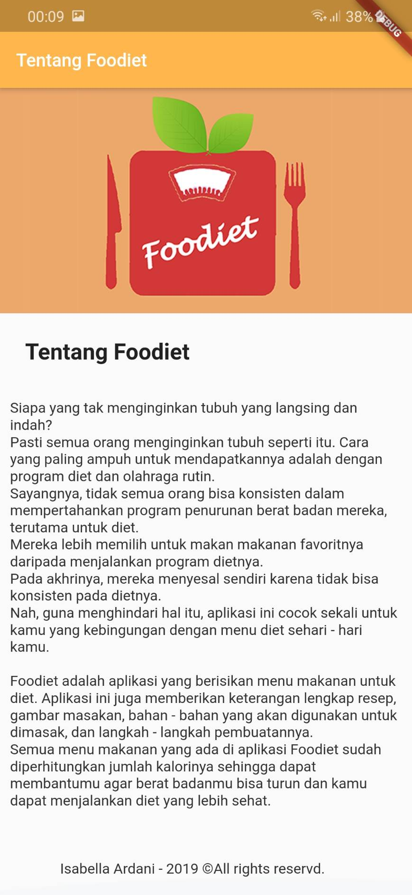
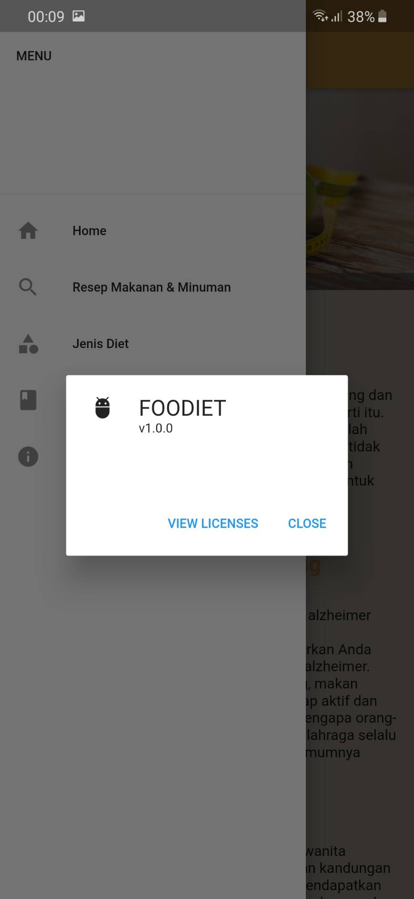

<h1>APLIKASI FOODIET</h1>
Aplikasi menu dan resep makanan dan minuman diet yang sehat.

<h3>1. Home</h3>

<h3>2. Menu</h3>

<h3>3. Resep Makanan & Minuman</h3>

<h3>4. Detail Resep Makanan & Minuman</h3>

<h3>5. Jenis Diet</h3>

<h3>6. Detail Jenis Diet</h3>

<h3>1. Tentang Diet</h3>

<h3>1. Versi Aplikasi</h3>

This project is a starting point for a Flutter application.

A few resources to get you started if this is your first Flutter project:

- [Lab: Write your first Flutter app](https://flutter.dev/docs/get-started/codelab)
- [Cookbook: Useful Flutter samples](https://flutter.dev/docs/cookbook)

For help getting started with Flutter, view our
[online documentation](https://flutter.dev/docs), which offers tutorials,
samples, guidance on mobile development, and a full API reference.
